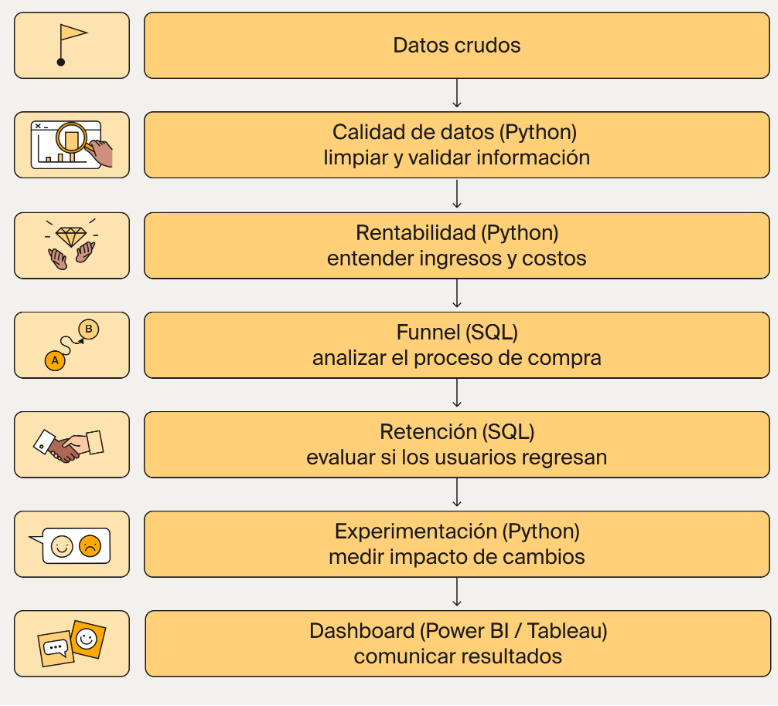

# RappiPlus-customer-analysis
Proyecto RappiPlus: De datos a decisiones de negocio

RappiPlus es un servicio de suscripción dentro del ecosistema de Rappi diseñado para aumentar la frecuencia de compra y el valor generado por usuario.

Sin embargo, el equipo de negocio no tiene claro si el servicio está cumpliendo su objetivo.

El proyecto abarcara temas como:

- Los usuarios realmente compran más
- El modelo está generando ganancias
- Se están perdiendo oportunidades en el proceso de compra

El análisis permite entender el desempeño del servicio y detecta oportunidades concretas de mejora.

## Cómo fluye el análisis

Cada etapa se construye sobre la anterior y responde una pregunta distinta del negocio.

🗺️ Diagrama general del proyecto

🔄 Que se espera en cada paso

Pasos	Pregunta_clave	                Resultado_esperado
1	    ¿Podemos confiar en los datos?	Dataset limpio
2	    ¿El negocio es rentable?	      KPIS(Revenue, cost, profit)
3	    ¿Dónde se pierden usuarios?	    Funnel
4	    ¿Los usuarios regresan?	        Cohortes
5	    ¿Los cambios funcionan?	        Test estadístico
6	    ¿Cómo comunicamos?	            Dashboard

💡 Nota: El notebook en la plataforma servirá de guía.

🚀 Inicio del análisis

🔹 Paso 1: Preparación y calidad de datos con Python

🎯 Pasos:
1 Evaluar la calidad de los datos.
2 Detectar inconsistencias.
3 Limpiar y estructurar datasets.
4 Generar un dataset listo para análisis.

📦 Entregable
3 datasets limpios.

📂 Dataset del proyecto
El análisis comienza con tres fuentes principales:

rappiplus_orders_raw.csv
rappiplus_catalog.csv
rappiplus_marketing_spend.csv

/datasets/rappiplus_orders_raw.csv
/datasets/rappiplus_catalog.csv
/datasets/rappiplus_marketing_spend.csv

📄 /rappiplus_orders_raw.csv

Cada fila representa un pedido realizado en la plataforma.

Columna	            Tipo_dato	    Descripción	                                    Ejemplo
id_pedido	          Categórica	  ID único del pedido	                            order_0
id_usuario	        Categórica	  Identificador del usuario que realizó el pedido	user_6993
fecha_hora_pedido	  Fecha	        Fecha en la que se realizó el pedido	          2025-05-22
pais	              Categórica	  País desde donde se realizó el pedido	          Argentina
dispositivo	        Categórica	  Dispositivo utilizado para realizar el pedido	  desktop
fuente_referencia	  Categórica	  Canal de adquisición del usuario	              organic
nombre_producto	    Categórica	  Nombre del producto comprado	                  Jacket-Winter-M
categoria_producto	Categórica	  Categoría del producto	                        Moda
cantidad	          Numérico	    Cantidad de productos comprados	                2
precio_unitario	    Numérico	    Precio por unidad del producto	                332.69
monto_descuento	    Numérico	    Descuento aplicado al pedido	                  0
monto_total	        Numérico	    Monto total pagado por el pedido	              665.37

📄 rappiplus_catalog.csv

Cada fila representa un producto disponible en la plataforma.

Columna	            Tipo_dato	    Descripción	                                    Ejemplo
nombre_producto	    Categórica	  Nombre del producto	                            Laptop-Gaming-16GB
categoria_producto	Categórica	  Categoría a la que pertenece el producto	      Electrónica
costo_unitario	    Numérico	    Costo por unidad del producto	                  280.68
proveedor	          Categórica	  Empresa proveedora del producto	                Fuller, Pena and Myers

📄 rappiplus_marketing_spend.csv

Cada fila representa una inversión en marketing realizada en un país y canal específico.

Columna	            Tipo_dato	     Descripción	                                  Ejemplo
fecha	              Fecha	         Fecha en la que se realizó la inversión	      2025-01-01
pais	              Categórica	   País donde se ejecutó la campaña	              Mexico
id_campaña	        Categórica	   Identificador único de la campaña	            organic_Mexico
canal	              Categórica	   Canal de marketing utilizado	                  organic
gasto	              Numérico	     Monto invertido en la campaña	                2446.25

💡 ¿Por qué vemos elementos en español e inglés en los datasets?

Hay herramientas como Google Analytics que, aunque estén en español, suelen exportar datos con categorías o términos en inglés.

Esto sucede porque hay plataformas utilizan estructuras internas estandarizadas y no traducen los datos crudos, únicamente la interfaz.

🔹 Paso 2: Análisis de rentabilidad del negocio con Python

🎯 Pasos:

1 Cálculo de KPIs (ejemplo ingresos/revenue, costos, ganancias).
2 Identificación de segmentos rentables.

🗂️ Fuentes de datos

Para este análisis se utilizarán los datasets del paso 1.

🔹 Paso 3: Análisis del funnel de conversión con SQL

🎯 Pasos:

1 Analizar el recorrido del usuario.
2 Funnel completo.
3 Detectar puntos de abandono.
4 Identificación del mayor drop-off.

🗂️ Fuente de datos

Para este análisis se utilizará la siguiente tabla:

events, que se encuentra almacenada en una base de datos.

⚙️ Importante: La conexión a esta base de datos se realizará desde el Jupyter Notebook.

La tabla contiene información del comportamiento de los usuarios dentro de la plataforma:

Columna	            Tipo_dato	    Descripción	                                  Ejemplo
id_usuario	        Categórica	  Identificador único del usuario	              user_6772
id_sesion	          Categórica	  Identificador único de la sesión	            6a97f2af-32ae-4186-8c92-04025be1a27b
nombre_evento	      Categórica	  Tipo de evento realizado por el usuario	      first_visit
timestamp_evento	  Fecha	        Fecha en la que ocurrió el evento	            2025-05-17
pais	              Categórica	  País desde donde se realizó el evento	        Colombia
dispositivo	        Categórica	  Dispositivo utilizado por el usuario	        desktop
fuente_referencia	  Categórica	  Canal de adquisición del usuario	            organic
categoria_producto	Categórica	  Categoría del producto relacionada al evento	Moda

🔹 Paso 4: Análisis de retención por cohortes con SQL

🎯 Pasos:

1 Analizar comportamiento en el tiempo.
2 Construir cohortes.
3 Insight de retención.

🗂️ Fuente de datos

Para este análisis se utilizarán las siguientes tablas:

Tabla users → Información de registro de usuarios.
Tabla user_activity → Actividad de los usuarios después del registro.

Estructura de las tablas:
Tabla users

Cada fila representa un usuario registrado en la plataforma.

Columna	        Tipo_dato	  Descripción	                            Ejemplo
id_usuario	    Categórica	Identificador único del usuario	        user_0
fecha_registro	Fecha	      Fecha en la que el usuario se registró	2025-01-29
pais	          Categórica	País de origen del usuario	            Mexico
dispositivo	    Categórica	Dispositivo utilizado al registrarse	  mobile
tipo_plan	      Categórica	Tipo de plan del usuario	              free

Tabla user_activity

Cada fila representa la actividad de un usuario después de su registro.
  
Columna	              Tipo_dato	  Descripción	                                                        Ejemplo
id_usuario	          Categórica	Identificador único del usuario	                                    user_0
fecha_actividad	      Fecha	      Fecha en la que se registra la actividad del usuario	              2025-02-05
dias_despues_registro	Numérico	  Número de días transcurridos desde el registro del usuario	        7
activo	              Numérico	  Indicador de si el usuario estuvo activo (1 = activo, 0 = inactivo)	0

🔹 Paso 5: Evaluación de impacto (experimentación A/B) con Python

🎯 Pasos:

1 Resultado del experimento.
2 Recomendación.

🗂️ Fuente de datos
Para este análisis se utilizará la siguiente tabla:

📄 /datasets/experiment_checkout_ui.csv

Cada fila representa la participación de un usuario en un experimento (A/B testing).

Columna	        Tipo_dato	    Descripción	                                                          Ejemplo
id_usuario	    Categórica	  Identificador único del usuario en el experimento	                    exp_user_0
variante	      Categórica	  Variante del experimento asignada al usuario (control o tratamiento)	tratamiento
convirtio	      Numérico	    Indicador de conversión (1 = convirtió, 0 = no convirtió)	            0
dispositivo	    Categórica	  Dispositivo utilizado por el usuario	                                mobile
pais	          Categórica	  País del usuario	                                                    Argentina
duracion_sesion	Numérico	    Duración de la sesión del usuario en segundos	                        114.41
timestamp	      Fecha	        Fecha en la que ocurrió la interacción	                              2025-03-28

⚠️ Asegúrate de usar esta ruta en el Notebook:
'/datasets/experiment_checkout_ui.csv'

🔹 Paso 6: Construcción del dashboard y comunicación de insights

🎯 Pasos:

1 Traducir análisis en visualización.
2 Comunicar insights.
3 Utilizar los archivos limpios generados en el Paso 1 como fuente de datos.

📦 Entregable

Dashboard final.

Si compartes el link del dashboard publicado (por ejemplo, desde Power BI o Tableau), no es necesario incluirlos.
